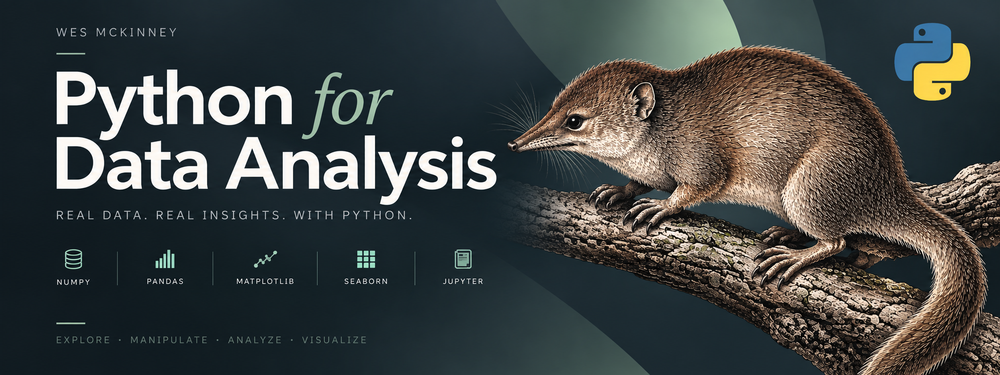

# Python for Data Analysis — Luis Fernández

Personal study workspace for learning **data science and artificial intelligence fundamentals** with Python.

This repository is organized around my own notebooks, practice exercises, and small portfolio projects. It uses selected learning materials, examples, and datasets from *Python for Data Analysis, 3rd Edition* as a foundation, but the focus is my own study process.

## Quick overview

| Area | Purpose |
| --- | --- |
| `book/notebooks/` | Chapter-by-chapter practice notebooks |
| `book/projects/` | Integrative projects for portfolio-style practice |
| `datasets/` | Data files used for analysis exercises |
| `examples/` | Supporting files used by the book examples |
| `requirements.txt` | Dependency list for notebook execution |
| `pyproject.toml` | Project metadata and Python environment definition |

## Learning goals

This repository is designed to help me build solid foundations in:

- Python for data analysis
- NumPy arrays, indexing, broadcasting, and vectorized computation
- pandas data loading, cleaning, transformation, joins, and aggregation
- exploratory data analysis
- visualization with Matplotlib and Seaborn
- time series analysis
- introductory modeling workflows with Python libraries

## Study method

The goal is not to copy notebooks line by line. The goal is to understand, rebuild, modify, and explain.

For each topic:

1. Read the concept.
2. Run the original example.
3. Rebuild it in my own notebook.
4. Modify inputs, columns, filters, or datasets.
5. Break the example on purpose and understand the error.
6. Write down what happened in my own words.
7. Turn the topic into a small project when possible.

## Repository structure

```text
.
├── asset/
│   └── image.png
├── book/
│   ├── notebooks/
│   │   ├── chapter_02.ipynb
│   │   ├── chapter_03.ipynb
│   │   ├── chapter_04.ipynb
│   │   ├── chapter_05.ipynb
│   │   ├── chapter_06.ipynb
│   │   ├── chapter_07.ipynb
│   │   ├── chapter_08.ipynb
│   │   ├── chapter_09.ipynb
│   │   ├── chapter_10.ipynb
│   │   ├── chapter_11.ipynb
│   │   ├── chapter_12.ipynb
│   │   └── chapter_13.ipynb
│   └── projects/
│       ├── babynames-analysis.ipynb
│       ├── movielens-analysis.ipynb
│       └── titanic-analysis.ipynb
├── datasets/
├── examples/
├── requirements.txt
├── pyproject.toml
└── README.md
```

## Chapter notebooks

The notebooks inside `book/notebooks/` are my organized chapter workspace.

| Notebook | Topic |
| --- | --- |
| `chapter_02.ipynb` | Python basics, IPython, and Jupyter |
| `chapter_03.ipynb` | Built-in data structures, functions, and files |
| `chapter_04.ipynb` | NumPy basics and vectorized computation |
| `chapter_05.ipynb` | Getting started with pandas |
| `chapter_06.ipynb` | Data loading, storage, and file formats |
| `chapter_07.ipynb` | Data cleaning and preparation |
| `chapter_08.ipynb` | Data wrangling, joins, combine, and reshape |
| `chapter_09.ipynb` | Plotting and visualization |
| `chapter_10.ipynb` | Aggregation and group operations |
| `chapter_11.ipynb` | Time series |
| `chapter_12.ipynb` | Introduction to modeling libraries |
| `chapter_13.ipynb` | Data analysis examples |

## Projects

The `book/projects/` folder is for integrative practice: small projects where multiple skills are used together.

Current project notebooks:

- `babynames-analysis.ipynb`
- `movielens-analysis.ipynb`
- `titanic-analysis.ipynb`

Each project should include:

1. Problem or question
2. Dataset loading
3. Data inspection
4. Cleaning and transformation
5. Visual analysis
6. Conclusions
7. Next possible improvements

## Setup

### Option 1: uv

```bash
uv run jupyter notebook
```

### Option 2: pip

```bash
pip install -r requirements.txt
jupyter notebook
```

The environment keeps `pandas==2.0.3` for compatibility with the book examples.

## Git workflow

Before studying:

```bash
git status
```

After creating or updating notebooks:

```bash
git add book README.md .gitignore pyproject.toml requirements.txt
git commit -m "study: update notebook practice"
```

To publish changes:

```bash
git push
```

## Original source notebooks

The original root notebooks from the source repository are kept locally only as reference material:

```text
/ch02.ipynb ... /ch13.ipynb
/appa.ipynb
/appb.ipynb
```

They are intentionally ignored by Git in this personal repository. This keeps the remote repository focused on my own study work instead of tracking unchanged source material.

## Attribution

This repository is my personal study workspace.

Some learning materials, datasets, and examples are based on the open materials from **Python for Data Analysis, 3rd Edition** by Wes McKinney.

- Book: https://wesmckinney.com/book/
- Source materials: https://github.com/wesm/pydata-book

The original code examples are MIT-licensed by their original authors. My notes, organization, practice notebooks, and project work are maintained as my own learning material.
